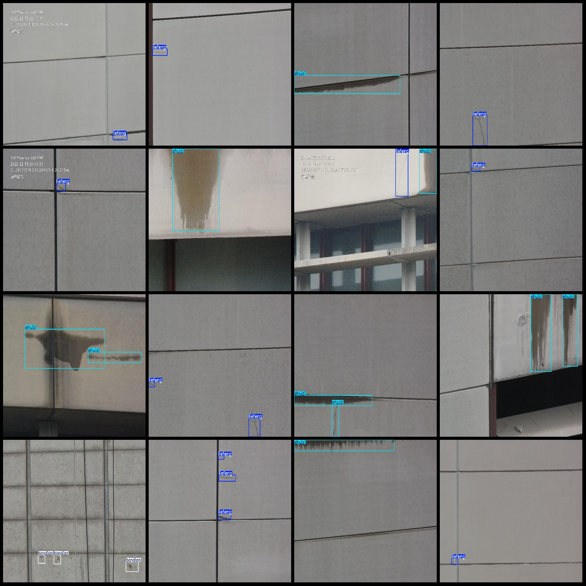
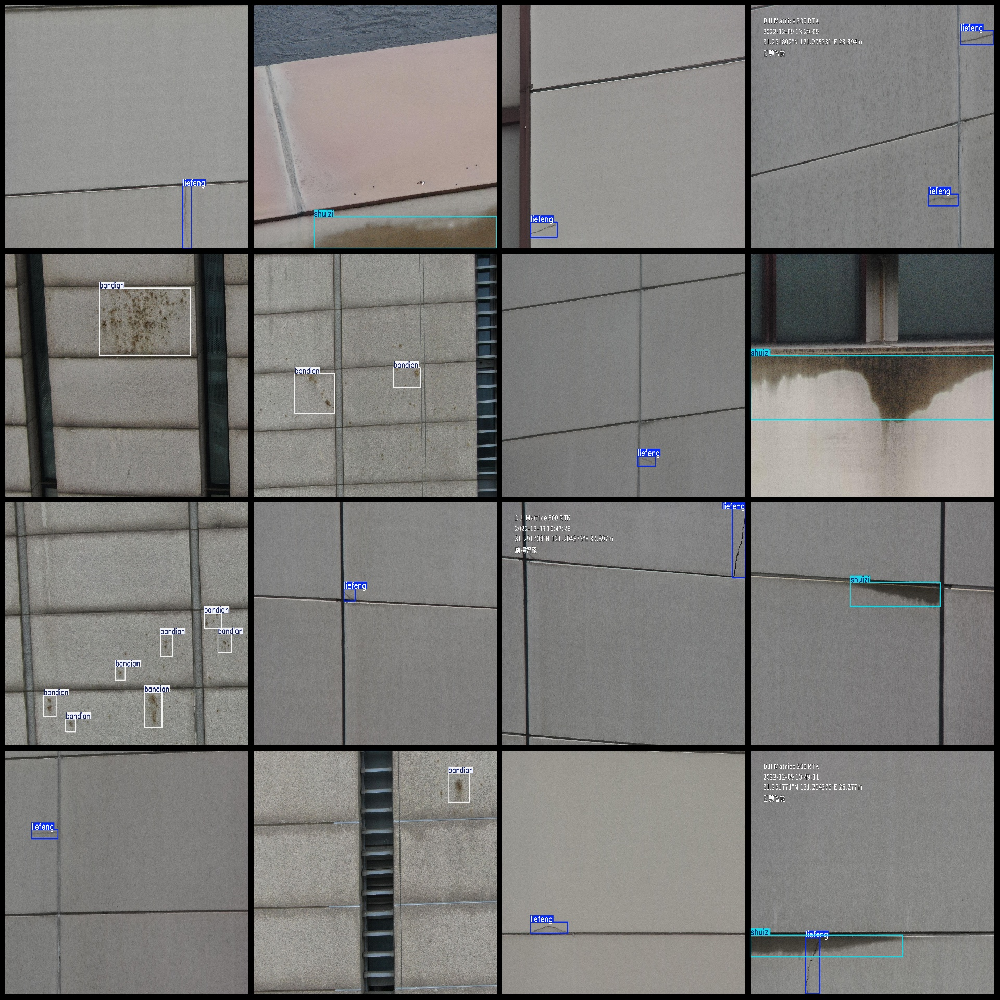

# Drone Viewpoint Smart Building Wall Tile Cracks, Chipping, and Watermark Detection Data Set in VOC+YOLO Format with 289 Categories

Dataset Format: Pascal VOC format plus YOLO format (without split path in the txt file, only including JPG images and corresponding VOC format xml files and YOLO format txt files)
Number of Images (JPG File Count): 289
Number of Annotations (Xml File Count): 289
Number of Annotations (Txt File Count): 289
Number of Annotation Categories: 4
Label Categories Name (Note that the order of categories in the YOLO format does not correspond to this, but is based on the labels folder's classes.txt): ["Bandian", "Boluo", "LieFeng", "ShuiZi"]
Corresponding Chinese Category Names: [Spots, Chipping, Crack, Watermark]
Total Boxes per Category: 483
Number of Pictures per Category: 
Bandian boxes = 105
Boluo boxes = 20
LieFeng boxes = 195
ShuiZi boxes = 163
Total Boxes: 483
Number of Pictures per Category: 
Bandian pictures = 33
Boluo pictures = 20
LieFeng pictures = 170
ShuiZi pictures = 112
Image Resolution: 2592x1943
Annotation Tool: labelImg
Annotation Rules: Draw a box around the category
Important Notice: The dataset does not have a separate training validation test set; it needs to be partitioned by oneself.
Special Reminder: This dataset does not guarantee any accuracy of the trained model or weight file.
Image Preview:
Annotation Example:

## Images

Here is a pay link on Stripe ( https://buy.stripe.com/3cs8yP7sY87d0vu9AB ). Please contact me lonlonago@foxmail.com after funding $89, and I will send you a complete data files , thank you!

